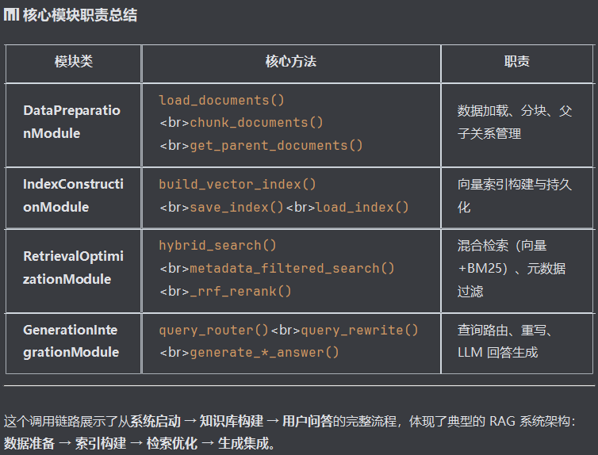

# 程序入口
main() 
  → RecipeRAGSystem.__init__()
  → RecipeRAGSystem.run_interactive(

# 系统初始化
RecipeRAGSystem.run_interactive()
  ├─→ RecipeRAGSystem.initialize_system()
  │    ├─→ DataPreparationModule.__init__()
  │    ├─→ IndexConstructionModule.__init__()
  │    │    └─→ IndexConstructionModule.setup_embeddings()
  │    └─→ GenerationIntegrationModule.__init__()
  │         └─→ GenerationIntegrationModule.setup_llm()

# 知识库构建
RecipeRAGSystem.run_interactive()
  └─→ RecipeRAGSystem.build_knowledge_base()
       ├─→ IndexConstructionModule.load_index()  # 尝试加载已保存的索引
       │
       ├─【如果索引不存在】
       │    ├─→ DataPreparationModule.load_documents()
       │    │    └─→ DataPreparationModule._enhance_metadata()
       │    │
       │    ├─→ DataPreparationModule.chunk_documents()
       │    │    └─→ DataPreparationModule._markdown_header_split()
       │    │
       │    ├─→ IndexConstructionModule.build_vector_index()
       │    │    └─→ FAISS.from_documents()
       │    │
       │    └─→ IndexConstructionModule.save_index()
       │
       ├─【如果索引已存在】
       │    ├─→ DataPreparationModule.load_documents()
       │    │    └─→ DataPreparationModule._enhance_metadata()
       │    └─→ DataPreparationModule.chunk_documents()
       │         └─→ DataPreparationModule._markdown_header_split()
       │
       └─→ RetrievalOptimizationModule.__init__()
            └─→ RetrievalOptimizationModule.setup_retrievers()
       
       └─→ DataPreparationModule.get_statistics()

# 问答交互
RecipeRAGSystem.run_interactive()
  └─→ RecipeRAGSystem.ask_question()
       ├─→ GenerationIntegrationModule.query_router()  # 查询路由
       │
       ├─【如果是列表查询】
       │    └─→ (保持原查询)
       │
       ├─【如果是详细/一般查询】
       │    └─→ GenerationIntegrationModule.query_rewrite()  # 查询重写
       │
       ├─→ RecipeRAGSystem._extract_filters_from_query()  # 提取过滤条件
       │    ├─→ DataPreparationModule.get_supported_categories()
       │    └─→ DataPreparationModule.get_supported_difficulties()
       │
       ├─【如果有过滤条件】
       │    └─→ RetrievalOptimizationModule.metadata_filtered_search()
       │         └─→ RetrievalOptimizationModule.hybrid_search()
       │              ├─→ self.vector_retriever.invoke()  # 向量检索
       │              ├─→ self.bm25_retriever.invoke()    # BM25检索
       │              └─→ RetrievalOptimizationModule._rrf_rerank()  # RRF重排
       │
       ├─【如果没有过滤条件】
       │    └─→ RetrievalOptimizationModule.hybrid_search()
       │         ├─→ self.vector_retriever.invoke()
       │         ├─→ self.bm25_retriever.invoke()
       │         └─→ RetrievalOptimizationModule._rrf_rerank()
       │
       ├─→ DataPreparationModule.get_parent_documents()  # 获取父文档
       │
       └─【根据路由类型生成回答】
            ├─【list 类型】
            │    └─→ GenerationIntegrationModule.generate_list_answer()
            │
            ├─【detail 类型】
            │    ├─→ GenerationIntegrationModule.generate_step_by_step_answer()
            │    │    └─→ GenerationIntegrationModule._build_context()
            │    │
            │    └─→ GenerationIntegrationModule.generate_step_by_step_answer_stream()  # 流式
            │         └─→ GenerationIntegrationModule._build_context()
            │
            └─【general 类型】
                 ├─→ GenerationIntegrationModule.generate_basic_answer()
                 │    └─→ GenerationIntegrationModule._build_context()
                 │
                 └─→ GenerationIntegrationModule.generate_basic_answer_stream()  # 流式
                      └─→ GenerationIntegrationModule._build_context()

# 其他功能方法
RecipeRAGSystem.search_by_category()
  └─→ RetrievalOptimizationModule.metadata_filtered_search()
       └─→ RetrievalOptimizationModule.hybrid_search()

RecipeRAGSystem.get_ingredients_list()
  ├─→ RetrievalOptimizationModule.hybrid_search()
  └─→ GenerationIntegrationModule.generate_basic_answer()

--------------------------------------------------------------------
整个查询效果并不理想的原因初步分析
    1.澄清，元数据查询是按分类和难度进行过滤没错，但是是在混合查询之后
    2.但是程序把元数据查询，放在了混合查询之后，意味着得先从向量中检索到chunk，再做元数据过滤

    